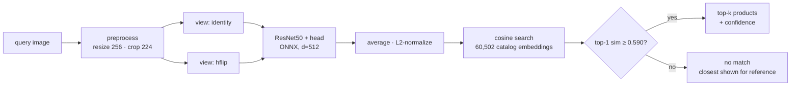

# Visual Product Search Engine with OOD-aware Retrieval

Image → top-k matching products from a catalog, or an explicit **"no match"** refusal when the
query is out-of-catalog. Built on Stanford Online Products (SOP): trained on one set of product
classes, evaluated on *unseen* products — retrieval, not classification.

## Architecture



Training: batch-hard triplet loss over PK batches on the SOP train split (11,318
products). Serving: the exported ONNX model, the test-split catalog (11,316 *unseen*
products), and a refusal threshold calibrated on held-out categories.

## Results

| Model | Loss | Recall@1 | Recall@5 | Recall@10 | mAP |
|---|---|---|---|---|---|
| ResNet50 (frozen, no training) | — | 53.09 | 64.76 | 68.99 | 27.78 |
| ResNet50 + head | Triplet (random negatives) | 59.54 | 73.30 | 78.21 | 36.60 |
| ResNet50 + head | Triplet (batch-hard mining) | **72.77** | 84.14 | 87.56 | 50.88 |
| ResNet50 + head | ArcFace (untuned) | 70.37 | 81.51 | 85.04 | 46.83 |

Recall/mAP as percentages, SOP test split (60,502 images, 11,316 unseen products),
leave-one-out protocol. Baseline measured on a Kaggle T4: 3m22s to embed, 1m36s to
evaluate (that search now runs on GPU when one is present). Each training run:
15 epochs, PK batches of 32x4, ~90 min on a T4.

**Batch-hard mining wins.** It gains more at R@1 (+13.2 over random negatives) than at
R@10 (+9.5), which is the signature of fixing confidently-wrong look-alikes rather than
merely reshuffling the tail. ArcFace is normally competitive or better, but was run at
the same 15-epoch budget with default scale/margin and no tuning — treat its row as a
lower bound, not a verdict on the method.

### Phase 3 — the look-alike problem

Top-1 errors of the trained model split into *look-alike* (right category, wrong
product) and *off-target*. Two training-free fixes were tried on the batch-hard model;
"hard R@1" is Recall@1 restricted to the queries the plain model got wrong on a
look-alike, so it measures how many of those specific failures each fix recovers.

| Variant | R@1 | R@5 | R@10 | mAP | hard R@1 |
|---|---|---|---|---|---|
| Trained, plain | 72.92 | 84.19 | 87.65 | 50.98 | 0.00 |
| + TTA (identity + hflip) | **73.91** | **84.81** | **88.12** | 52.09 | 9.06 |
| + TTA (identity + hflip + zoom) | 73.63 | 84.37 | 87.77 | 51.51 | **12.36** |
| + α-QE, k=2, α=1 | 72.92 | 80.84 | 83.61 | **52.93** | 0.00 |
| + α-QE, k=5, α=3 | 69.67 | 82.26 | 85.35 | 51.40 | 6.06 |

Full sweep in `results/phase3.json`. Plain R@1 differs from the training-time 72.77
only by evaluation batch size / precision.

**Findings.** Horizontal-flip TTA is a small, free, consistent win (+1.0 R@1, +1.1 mAP)
and recovers 9% of look-alike failures; adding a zoom view recovers more of them (12%)
but breaks enough easy cases to net out lower. Query expansion never helped R@1: at
k≤2 it changes nothing, at k≥3 it hurts, because SOP products have only ~5 images so
larger neighbourhoods pull in other products. It does raise mAP at the cost of R@5/10 —
it tightens correct clusters and reinforces wrong ones alike. The look-alike problem is
therefore mostly *not* fixable at test time; ~90% of those failures survive every cheap
trick, which points at training (harder mining, higher resolution) rather than inference.

### Phase 4 — OOD refusal ("no match")

A retrieval system answers every query, including a photo of a dog. The gate scores each
query by cosine similarity to its nearest catalog item (hflip-TTA embeddings, batch-hard
model) and refuses below a threshold. Reported as a tradeoff, never a single number.

Two out-of-catalog query sets, hard and easy:

| Out-of-catalog set | AUROC | refused @ 1% | @ 2% | @ 5% | @ 10% |
|---|---|---|---|---|---|
| Held-out SOP categories (products we don't carry) | 0.928 | 22.0% | 33.2% | 55.1% | 74.5% |
| ImageNet-mini val, 3,923 images (mostly not products) | 0.963 | 50.2% | 62.1% | 78.8% | 89.6% |

Columns are the % of out-of-catalog queries correctly refused at a fixed budget of valid
queries wrongly refused. Held-out is 4 folds × 3 categories, every category held out once
(per-fold AUROC 0.905–0.942). Top-1 similarity beat a top-3 mean on every fold, so the
gate uses top-1. Details in `results/ood/`.

**Shipped gate:** threshold **0.590**, calibrated on the hard case at a 5% false-refusal
budget. At that setting it refuses 55% of products the catalog doesn't carry and 78% of
non-product images, while wrongly refusing 4.95% of valid queries. The hard case is the
honest one: a kettle we don't sell still looks like a kettle, and roughly 45% of those get
answered with the nearest kettle we do sell. Non-product junk is much easier to reject.

### Phase 5 — serving

Everything below runs on **numpy + onnxruntime only** — no PyTorch at inference.
ONNX output matches PyTorch to 8.8e-08; the numpy preprocessing is bit-exact against
torchvision's. One query (two views + search over 60k) takes ~110 ms on CPU.

**API**

```bash
VPSE_BUNDLE=serve/bundle_full uvicorn vpse.serve.api:app --port 8000
curl -F file=@photo.jpg "localhost:8000/search?k=5"
```

```json
{"match": true, "confidence": 0.934, "threshold": 0.590,
 "results": [{"rank": 1, "similarity": 0.934, "product_id": 252035063072,
              "category": "bicycle", "image": "bicycle_final/252035063072_0.JPG",
              "gallery_index": 0}, ...]}
```

`match: false` means the nearest item fell below the gate; `results` still lists the
closest products so a caller can show them as "similar, but not in our catalog".

**Demo** (Gradio, HuggingFace-Spaces-ready)

```bash
VPSE_BUNDLE=serve/bundle_demo python demo/app.py
```

**Bundles.** `notebooks/kaggle_phase5_export.ipynb` turns the checkpoint into two
zips: `bundle_full` (all 60,502 catalog images, for the API) and `bundle_demo`
(2,000 products with thumbnails, for the Space). To publish the demo:

```bash
python scripts/stage_space.py --bundle serve/bundle_demo --out space
# then: cd space && git init && git remote add origin https://huggingface.co/spaces/<you>/<name> && git add . && git commit -m demo && git push
```

### Known limitations — what the gate does *not* catch

Probing the shipped engine with synthetic inputs turned up two things worth stating plainly.

**Blank images were matched, not refused.** A solid-black upload scored a perfect
1.000 — because SOP's catalog contains an all-black listing photo, and a solid-white
upload scored 0.875 against ordinary products on white backgrounds. A similarity gate
cannot reject a query that genuinely resembles something in the catalog. Two fixes,
both shipped: near-blank images (pixel std < 3; there were 2 in 60,502) are dropped
from the gallery at build time, and the engine refuses any query with pixel std < 5
*before* embedding, with `refusal_reason: "blank_image"`. Real photos sit far above
that (lowest seen: 12.8).

**Pixel noise still passes.** Uniform random noise scores ~0.68, above the 0.590 gate,
and lands on chairs. This is a general property of feature-similarity OOD detection —
a CNN maps texture-like noise to a plausible "generic object" embedding — and the
Phase 4 numbers were measured on real photographs (held-out products, ImageNet),
which is what a product-search deployment actually receives. Rejecting adversarial
or synthetic inputs would need a separate detector; it is out of scope here and the
number is reported rather than hidden.

## Project layout

```
src/vpse/
  config.py        # all hyperparameters in one dataclass
  data/sop.py      # Stanford Online Products dataset + train/test class split
  data/samplers.py # PK sampler (P classes × K images) for mining-friendly batches
  models/embedder.py   # ResNet50 backbone + embedding head
  losses/triplet.py    # triplet loss: random + batch-hard negative mining
  losses/arcface.py    # ArcFace head + loss
  retrieval/index.py   # FAISS index build / query
  retrieval/eval.py    # Recall@k, mAP
  ood/gate.py          # similarity score, refusal curve, AUROC, operating points
  ood/protocol.py      # held-out-category OOD split
  ood/data.py          # any folder of images as out-of-catalog queries
  ood/plots.py         # score histograms + refusal operating curve figure
  retrieval/tta.py     # test-time augmentation (multi-view embedding average)
  retrieval/rerank.py  # alpha-weighted query expansion
  analysis/errors.py   # look-alike vs off-target error breakdown
  analysis/grids.py    # query -> top-k result figures
  serve/export.py      # ONNX export + torch/onnxruntime parity check
  serve/bundle.py      # serving bundle: onnx + gallery + catalog + gate (+ thumbs)
  serve/engine.py      # search engine over a bundle (numpy + onnxruntime, no torch)
  serve/api.py         # FastAPI: POST /search -> top-k or "no match"
  train.py             # training loop (works locally or on Kaggle)
scripts/
  run_baseline.py           # Phase 1: frozen backbone → index → metrics → grid
  make_kaggle_notebook.py   # regenerate the phases 0-2 Kaggle notebook
  make_phase3_notebook.py   # regenerate the Phase 3 Kaggle notebook
  make_phase4_notebook.py   # regenerate the Phase 4 (OOD) Kaggle notebook
  make_phase5_notebook.py   # regenerate the Phase 5 export notebook
  clean_bundle.py           # drop degenerate gallery images from an existing bundle
  stage_space.py            # assemble a HuggingFace Space folder from a demo bundle
demo/app.py        # Gradio demo (HF Spaces-ready)
notebooks/         # Kaggle-facing notebooks (thin wrappers around src/)
```

## Setup

```bash
pip install -r requirements.txt
```

### Running on Kaggle GPU

`notebooks/kaggle_selfcontained.ipynb` embeds the whole `vpse` package, so it needs no
clone and no uploaded source. On Kaggle: *File → Upload Notebook*, *Add Data* → Stanford
Online Products, *Settings → Accelerator* → GPU, then Run All. Baseline takes ~10 min.

Regenerate it after editing anything under `src/vpse/`:

```bash
python scripts/make_kaggle_notebook.py
```

Locally the same code runs on CPU at roughly 7 images/sec (~2.5 h for the test split).

Dataset: [Stanford Online Products](https://www.kaggle.com/datasets/kwentar/stanford-online-products)
(~120k images, 22,634 products, 12 categories). Place/extract under `data/Stanford_Online_Products/`
so that `Ebay_train.txt` and `Ebay_test.txt` sit in that folder. The official split is built in:
train = class ids 1–11318, test = 11319–22634 (disjoint products).

## Plan / status

- [x] **Phase 0** — setup, data loading, verify split
      (59,551 train / 60,502 test images; 11,318 vs 11,316 products; splits disjoint)
- [x] **Phase 1** — frozen ResNet50 baseline + FAISS retrieval loop + metrics
      (R@1 53.09 / R@5 64.76 / R@10 68.99 / mAP@100 27.78)
- [x] **Phase 2** — metric learning: triplet → batch-hard → ArcFace (results table)
      (best: batch-hard triplet, R@1 72.77)
- [x] **Phase 3** — look-alike error analysis, TTA, re-ranking
      (hflip TTA: +1.0 R@1 → 73.91; query expansion no help; ~90% of look-alike failures remain)
- [x] **Phase 4** — OOD refusal layer + precision/recall tradeoff curve
      (AUROC 0.928 hard / 0.963 easy; gate @ 0.590 refuses 55% / 78% at 5% false-refusal)
- [x] **Phase 5** — ONNX export, FastAPI endpoint, Gradio demo, README
      (ONNX parity 8.8e-08; ~110 ms/query on CPU; demo verified live)
